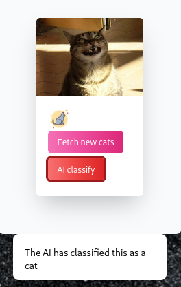

# Website for Dog and Cat Image Classification

This website allows users to view pictures of dogs and cats, and use an AI-powered image classification feature to determine whether the displayed image is a dog or a cat. Users can also change the displayed image by clicking on buttons provided on the website.
Features

    Display images of dogs and cats
    AI-powered image classification to determine whether the displayed image is a dog or a cat
    Buttons to change the displayed image

## Table of Contents

- [Features](#features)
- [Technologies used](#technologies-used)
- [Screenshots](#screenshots)
- [Usage](#usage)
- [Contributing](#contributing)
- [Credits](#Credits)
- [License](#license)
- [Acknowledgements](#acknowledgements)

## Features

- User-friendly web interface for interacting with the AI
- Fetch images from the catAPII and dogAPI
- Integration with a Convolutional Neural Network for image classification

## Technologies Used

    HTML
    CSS
    JavaScript
    Tailwind CSS (optional, for styling)
    TensorFlow (for image classification)
    Django

## Screenshots

## Usage

    Clone the repository to your local machine.
    Install the requirements.
    Run git-lfs pull
    Run python manage.py runserver.
    Click on the "Fetch new dogs, cats" button to display a random image of a dog or a cat.
    Click on the "AI classify" button to use the AI-powered image classification feature to determine whether the displayed image is a dog or a cat.
    Repeat steps 5-6 to load and classify different images.

## Configuration

Describe any configuration options or environment variables that your project uses.

| Variable      | Description                  | Default     |
| ------------- | ---------------------------- | ----------- |
| `SECRET_KEY`  | Secret Django Key, generate at  https://djecrety.ir/    | `null`   |

## Contributing

If you would like to contribute to this project, feel free to fork the repository, make your changes, and submit a pull request. Contributions are welcome and appreciated!

## Credits

    Images of dogs and cats used in this website are obtained from Free Code Camp (sample images used for demonstration and completion of the course only).
    AI-powered image classification is done using TensorFlow, a Python library for machine learning, developed by Google.
    The website design and layout were created using Tailwind CSS

## License

This website is open-source and available under the [MIT License](LICENSE). You are free to use, modify, and distribute this code for any purpose.

## Acknowledgements

- This project was made as an expansion of the Fcc_cat_dog project
- Special thanks to the Django community for providing a powerful and flexible web framework for Python developers.
- Thanks to the team at Free Code Camp for their wonderful job at teaching Machine Learning